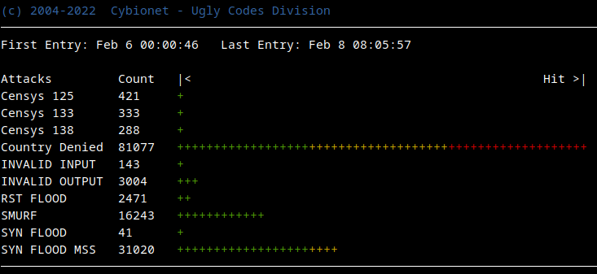

| ![alt text][logo] | Integration & Securite Systeme |
| ------------- |:-------------:|

# Cybionet - Ugly Codes Division

## SUMMARY

Easy installation script of Zabbix Proxy service with SQLite3.

## REQUIRED

The `40-iptables` application requires the following additional packages to work. Use apt-get command to install these dependencies.

Dependancy: 
 - iptables-persistent or netfilter-persistent
 - ipset

Recommended:
 - xtables-addons-common
 - geoip-bin
 - geoip-database

 

## FEATURES SUPPORTED

- Allow Predefine services
- Allow restricted IP for management access.
- Greenlist/Redlist
- Custom rules support
- Block Shodan hosts
- Extra block for Censys,Sonar, ShdowServer hosts
- Block DNS Queries by domainnames
- SMURF attack
- NULL packets
- SYN FLOOD attack
- SYN FLOOD attack - MSS
- XMAS paquets attack
- INVALID packets
- Rate-limit incoming SSH connections
- Block Port Scan

## INCLUDED ADDONS
- Geoip (Allow/Block)
- Spamhaust Drop/EDrop list
- Block Tor Exit Nodes

## EXTRA TOOL

Tools to show you attacks blocked.

 

## INSTALLATION

[Installation and Configuration](INSTALL.md) 

---
[logo]: ./md/logo.png "Cybionet"
