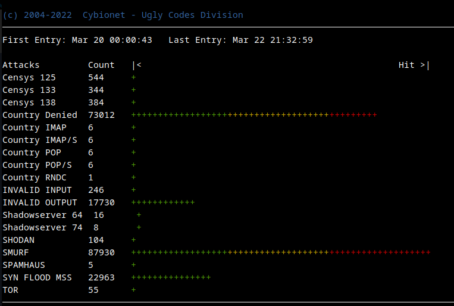

![alt text][logo]

# Cybionet - Ugly Codes Division

## SUMMARY

Script to customize the IPv4 rules and add some extra security rules. Also blocks the IPv6 connexions.

## REQUIRED

The `40-iptables` application requires the following additional packages to work. Use apt-get command to install these dependencies.

Dependancy: 
 - iptables-persistent or netfilter-persistent
 - ipset

## SUPPORTED FEATURES

- Authorize predefined services
- Allow restricted IP addresses for management access
- Greenlist/Redlist
- Support for custom rules
- Block Shodan hosts
- Extra blocks for Censys,Sonar, ShadowServer hosts
- Block DNS queries by domain names
- SMURF attack
- NULL packets
- SYN FLOOD attack
- SYN FLOOD attack - MSS
- XMAS paquets attack
- INVALID packets
- Rate-limit incoming SSH connections
- Block Port Scan

## INCLUDED ADDONS

- Geoip (Allow/Block)
- Spamhaus Drop/EDrop list
- Block Tor Exit Nodes
- KillNet DDoS Blocklist
- Redlist (soon)
- Shodan Search Engine Blocklist (soon)

## EXTRA TOOL

Tool to show you blocked attacks. For example, a quiet start to the week.

## INSTALLATION

[Installation and Configuration](INSTALL.md) 

---
[logo]: ./md/logo.png "Cybionet"
